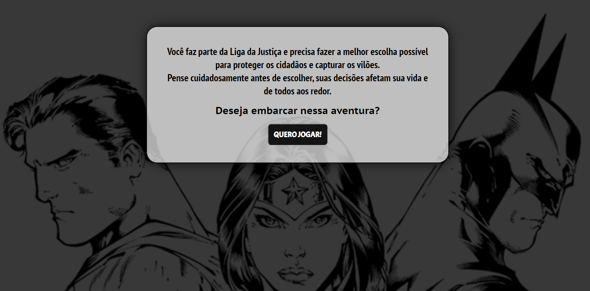

# Projeto Final do Módulo 1: Jogos Super-Heróis

> ## Sobre

  O projeto de encerramento do módulo 1 do curso Resilia Webdev é um jogo de escolhas. O jogo tem como mecanismo principal de funcionamento as escolhas feitas pelo usuário via prompt. Elas deverão levar o jogador, com o personagem escolhido através de toda uma narrativa.

> ## Pré-requisitos

  - Deve ser possível jogar com ao menos 3 personagens diferentes e ao menos 3 etapas/fases devem ser implementadas para cada personagem;
  - Os textos da narrativa devem ser apresentados na página HTML;
  - A verificação da entrada de dados do usuário deve ser realizada utilizando estruturas de repetição;
  - Estruturas condicionais devem ser utilizadas para guiar o jogador pela narrativa;
  - Cada etapa/fase deve ser implementada em um arquivo diferente;
  - Funções devem ser criadas e utilizadas para uma maior e melhor legibilidade do código;
  - O projeto desenvolvido deve ser fornecido em repositório no Github.

 

> ## Softwares e Ferramentas utilizadas nesse projeto 

  - HTML5
  - CSS3
  - JavaScript
  - Git
  - Kanban

> ## Habilidades Adquiridas

  - Indentação do código
  - Tags semânticas (HTML)
  - Atributos (HTML)
  - Seletores e Combinadores (CSS)
  - Pseudo-classes (CSS)
  - FlexBox (CSS)
  - Responsividade (CSS)
  - Function (JS)
  - Condicionais IF, Else (JS)
  - Utilização de metodologias ágeis (Kanban)

> ## Autora

  - [Hadassa Moraes](https://www.linkedin.com/in/hadassa-moraes-5a6712230/)

> ## Site

  Acesse o projeto clicando <a href="https://hadmoraes.github.io/jogoProjetoResiliaM1/">aqui</a>

  &#129145;&nbsp;<a href="#inicio"><strong>Voltar ao topo</strong></a>&nbsp;&#129145;

